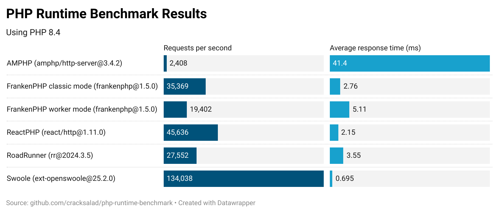

# PHP Runtime Benchmarks

There are quite a few PHP runtime right now and all of them address performance as one of the main concerns. 
So the obvious question is, which one is actually the fastest. Since runtimes are hard to compare in total, we have to start somewhere: I chose HTTP Server as the first use case to compare the runtimes in.

This whole benchmark is oriented on ["Performance benchmark of PHP runtimes" by Dzmitry Kazbiarovich from January 2024](https://dev.to/dimdev/performance-benchmark-of-php-runtimes-2lmc), which lacks AMPHP and ReactPHP as runtime alternatives and is pretty focused on Symfony and Docker.

So this benchmarks work independent of Symfony and Docker. The actual measurements are performed by [k6 by Grafana Labs](https://k6.io/open-source/).

## Featuring...

- AMPHP
- FrankenPHP (classic and worker mode)
- ReactPHP
- RoadRunner
- Swoole

If you want to see other alternatives, please let me know!

## Results

All benchmarks have been performed with a **30 second duration**. During that time, the servers handled as many requests as they can. 
The servers respond with a simple `"Hello, world!"` and a `Content-Type: text/plain` header as well as a status code 200.
The **VUS (number of parallel requests) has been set to 100**.
The following numbers have been measured/calculated by *k6*:

Raw numbers

|Runtime|VUS|Requests per second|Average response time (ms)|
|-------|---|-------------------|---------------------|
|AMPHP (amphp/http-server@3.4.2)|100|2,408|41.4|
|FrankenPHP classic mode (frankenphp@1.5.0)|100|35,369|2.76|
|FrankenPHP worker mode (frankenphp@1.5.0)|100|19,402|5.11|
|ReactPHP (react/http@1.11.0)|100|45,636|2.15|
|RoadRunner (rr@2024.3.5)|100|27,552|3.55|
|Swoole (ext-openswoole@25.2.0)|100|134,038|0.695|

### Personal opinion

This is an unexpectedly clear result. It is a pity that Swoole is the most poorly documented of the alternatives compared (the sample code from the documentation contains many errors that first had to be fixed to create this benchmark). Sadly, this makes a recommendation difficult.

## How to benchmark

1. Start a server of your choice from the `src` folder. 
    - In case of *FrankenPHP classic mode*, you need to run `frankenphp php-server --root src --address localhost:1337`.
    - In case of *FrankenPHP worker mode*, you need to run `frankenphp php-server --root src --listen localhost:1337 --worker src/frankenphp-workers.php`.
    - In case of *RoadRunner*, you need to run `rr serve`.
    - Otherwise, run `php src/<SERVER>.php`.
2. Run `k6 run --vus <VUS> bench/mark.ts` with `<VUS>` being the number of parallel executions.
3. Wait 30 seconds and voilà!

## Docs of different runtimes

- [amphp.org](https://amphp.org/http-server)
- [frankenphp.org](https://frankenphp.dev/docs/worker/)
- [reactphp.org](https://reactphp.org/http/#server-usage)
- [docs.roadrunner.dev](https://docs.roadrunner.dev/docs/general/quick-start)
- [openswoole.com](https://openswoole.com/docs/modules/swoole-http-server-doc)
