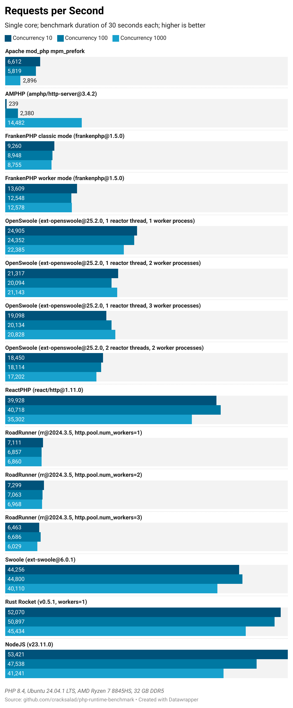

# PHP Runtime Benchmarks

There are quite a few PHP runtimes right now and all of them address performance as one of the main concerns. 
So the obvious question is, which one is actually the fastest. Since runtimes are hard to compare in total, we have to start somewhere: I chose HTTP Server as the first use case to compare the runtimes in.

This whole benchmark is oriented on ["Performance benchmark of PHP runtimes" by Dzmitry Kazbiarovich from January 2024](https://dev.to/dimdev/performance-benchmark-of-php-runtimes-2lmc), which lacks AMPHP and ReactPHP as runtime alternatives and is pretty focused on Symfony.

So this benchmarks work independent of Symfony. The actual measurements are performed by [k6 by Grafana Labs](https://k6.io/open-source/).

## Featuring...

- AMPHP
- FrankenPHP (classic and worker mode)
- OpenSwoole
- ReactPHP
- RoadRunner
- Swoole

If you want to see other alternatives, please let me know!

As references I chose Apache mod_php with mpm_prefork as baseline, Rust Rocket as some kind of upper limit and NodeJS as the probably main competitor.

### AMPHP

AMPHP uses modern PHP features like Fibers to provide pseudo-parallel execution with Coroutines.

This benchmark currently does not look at event loop extensions, which are supported by Revolt (which is internally used by AMPHP). See [https://revolt.run/extensions](https://revolt.run/extensions).

### FrankenPHP and RoadRunner

FrankenPHP and RoadRunner are different Go implementations of the PHP runtime.

### ReactPHP

ReactPHP is a PHP library for event-driven programming introducing an event loop.

### Swoole and OpenSwoole

Swoole and OpenSwoole are C++ extensions for PHP which include e.g. an HTTP server and provide Coroutine, Thread and Process based concepts.
OpenSwoole is actually a fork of Swoole.

## Results

During the benchmark, the servers handled as many requests as they can in a fixed amount of time and with different amounts of concurrent requests. 
The servers respond with a simple `"Hello, world!"` and a `Content-Type: text/plain` header as well as a status code 200.
The following numbers have been measured/calculated by *k6*:

Raw numbers

All HTTP servers run in an Alpine-based PHP 8.4 Docker image limited to a single CPU core to get comparable results. Memory is not limited since it is not expected to make any difference here.

|Runtime|VUS|Requests per second|Average response time (ms)|
|-------|--:|------------------:|--------------------------|
|Apache mod_php mpm_prefork|10|6,612|1.46|
|Apache mod_php mpm_prefork|100|5,819|17.1|
|Apache mod_php mpm_prefork|1000|2,896|219|
|AMPHP (amphp/http-server@3.4.2)|10|239|41.7|
|AMPHP (amphp/http-server@3.4.2)|100|2,380|41.9|
|AMPHP (amphp/http-server@3.4.2)|1000|14,482|68.8|
|FrankenPHP classic mode (frankenphp@1.5.0)|10|9,260|1.05|
|FrankenPHP classic mode (frankenphp@1.5.0)|100|8,948|11.1|
|FrankenPHP classic mode (frankenphp@1.5.0)|1000|8,755|114|
|FrankenPHP worker mode (frankenphp@1.5.0)|10|13,609|0.71|
|FrankenPHP worker mode (frankenphp@1.5.0)|100|12,548|7.93|
|FrankenPHP worker mode (frankenphp@1.5.0)|1000|12,578|79.2|
|OpenSwoole (ext-openswoole@25.2.0, 1 reactor thread, 1 worker process)|10|24,905|0.376|
|OpenSwoole (ext-openswoole@25.2.0, 1 reactor thread, 1 worker process)|100|24,352|4.07|
|OpenSwoole (ext-openswoole@25.2.0, 1 reactor thread, 1 worker process)|1000|22,385|44.5|
|OpenSwoole (ext-openswoole@25.2.0, 1 reactor thread, 2 worker processes)|10|21,317|0.439|
|OpenSwoole (ext-openswoole@25.2.0, 1 reactor thread, 2 worker processes)|100|20,094|4.69|
|OpenSwoole (ext-openswoole@25.2.0, 1 reactor thread, 2 worker processes)|1000|21,143|47.1|
|OpenSwoole (ext-openswoole@25.2.0, 1 reactor thread, 3 worker processes)|10|19,098|0.49|
|OpenSwoole (ext-openswoole@25.2.0, 1 reactor thread, 3 worker processes)|100|20,134|4.91|
|OpenSwoole (ext-openswoole@25.2.0, 1 reactor thread, 3 worker processes)|1000|20,828|47.9|
|OpenSwoole (ext-openswoole@25.2.0, 2 reactor threads, 2 worker processes)|10|18,450|0.509|
|OpenSwoole (ext-openswoole@25.2.0, 2 reactor threads, 2 worker processes)|100|18,114|5.47|
|OpenSwoole (ext-openswoole@25.2.0, 2 reactor threads, 2 worker processes)|1000|17,202|57.9|
|ReactPHP (react/http@1.11.0)|10|39,928|0.188|
|ReactPHP (react/http@1.11.0)|100|40,718|2.41|
|ReactPHP (react/http@1.11.0)|1000|35,302|28.2|
|RoadRunner (rr@2024.3.5, http.pool.num_workers=1)|10|7,111|1.37|
|RoadRunner (rr@2024.3.5, http.pool.num_workers=1)|100|6,857|14.5|
|RoadRunner (rr@2024.3.5, http.pool.num_workers=1)|1000|6,860|145|
|RoadRunner (rr@2024.3.5, http.pool.num_workers=2)|10|7,299|1.34|
|RoadRunner (rr@2024.3.5, http.pool.num_workers=2)|100|7,063|14.1|
|RoadRunner (rr@2024.3.5, http.pool.num_workers=2)|1000|6,968|143|
|RoadRunner (rr@2024.3.5, http.pool.num_workers=3)|10|6,463|1.51|
|RoadRunner (rr@2024.3.5, http.pool.num_workers=3)|100|6,686|14.9|
|RoadRunner (rr@2024.3.5, http.pool.num_workers=3)|1000|6,029|165|
|Swoole (ext-swoole@6.0.1)|10|44,256|0.202|
|Swoole (ext-swoole@6.0.1)|100|44,800|2.2|
|Swoole (ext-swoole@6.0.1)|1000|40,110|24.8|
|Rust Rocket (v0.5.1, workers=1)|10|52,070|0.168|
|Rust Rocket (v0.5.1, workers=1)|100|50,897|1.93|
|Rust Rocket (v0.5.1, workers=1)|1000|45,434|21.9|
|NodeJS (v23.11.0)|10|53,421|0.163|
|NodeJS (v23.11.0)|100|47,538|2.07|
|NodeJS (v23.11.0)|1000|41,241|24.2|

### Notes

First of all, it should be noted, that I am comparing mostly stock configurations here. There are most probably ways to tweak the performance of the individual runtimes. Feel free to look at the server implementations and test your own configurations (and please let me know if you find something interesting!).

- The average response time seems to be roughly proportional to the amount of concurrent requests.
- AMPHP is really bad below 1000 parallel requests, but it outperformes FrankenPHP and RoadRunner at 1000 parallel requests.
- Although ReactPHP is plain PHP - no Go, no C++ - it is way faster than I expected.
- Why is OpenSwoole about half as fast as Swoole? They are expected to be quite similar.

## How to benchmark

1. Start a server of your choice from the `src` folder. 
    1. `cd src/<runtime>`
    2. `docker build -t cracksalad/php-runtime-benchmark-http-server-<runtime> .`
    3. `docker run --rm --cpus 1 -p 1337:1337 -it cracksalad/php-runtime-benchmark-http-server-<runtime>`
2. Run `k6 run --vus <VUS> bench/mark.ts` with `<VUS>` being the number of parallel executions.
3. Wait 30 seconds and voilà!

## Docs of different runtimes

- [amphp.org](https://amphp.org/http-server)
- [frankenphp.org](https://frankenphp.dev/docs/worker/)
- [openswoole.com](https://openswoole.com/docs/modules/swoole-http-server-doc)
- [reactphp.org](https://reactphp.org/http/#server-usage)
- [docs.roadrunner.dev](https://docs.roadrunner.dev/docs/general/quick-start)
- [swoole.com](https://wiki.swoole.com/en/#/start/start_http_server)
